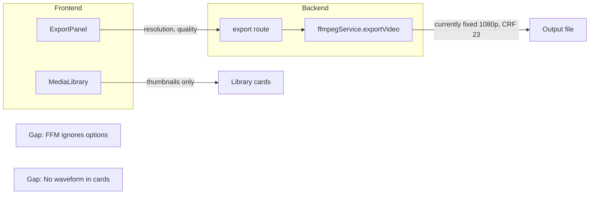

# Vidzaro: Feature audit and implementation plan

## Summary

Most README features are **implemented**. Gaps are: (1) export resolution/quality not applied in backend, (2) waveforms in media library, (3) clip settings panel viewport overflow, (4) play/pause state when switching preview vs timeline, and (5) several TODO items (transitions, audio meters, memory/performance, error handling). Detach audio is **logical-only** (no FFmpeg extraction).

---

## 1. README features – implemented vs gaps

### Editing – **Implemented**

- Multi-track timeline, trim (drag edges), split (S / toolbar), reorder (drag), Select (V) / Ripple (B), clip context menu (filters, speed, volume, fade, text overlay), text overlays (position, size, color, animations), video filters (grayscale, sepia, invert, blur, brighten, darken, contrast, saturate, hue, vintage, cool/warm), **detach audio** (frontend: duplicate clip as audio-only on same source; no backend extraction), dynamic tracks (add/remove/rename).  
- **References:** [frontend/src/hooks/useProject.js](frontend/src/hooks/useProject.js) (splitClip, detachAudio, tracks), [frontend/src/components/Timeline/Clip.jsx](frontend/src/components/Timeline/Clip.jsx) (trim, context menu, filters, text), [frontend/src/components/Timeline/Timeline.jsx](frontend/src/components/Timeline/Timeline.jsx) (reorder, ripple).

### Project & File – **Implemented**

- Save (File System Access API + download fallback), Load (file picker + JSON parse), New, Auto-save (localStorage, debounced, recover on reload).  
- **References:** [frontend/src/components/Project/SaveDialog.jsx](frontend/src/components/Project/SaveDialog.jsx), [frontend/src/components/Project/FileDialog.jsx](frontend/src/components/Project/FileDialog.jsx), [frontend/src/hooks/useProject.js](frontend/src/hooks/useProject.js) (loadAutoSave, clearAutoSave).

### Screen recording – **Implemented**

- getDisplayMedia (screen/window/tab), optional custom region, system audio + mic (volume, noise suppression), webcam overlay (position, size, shape, blur, live preview), overlays (cursor highlight, click effect, key overlay), output (MP4/WebM/MKV, 720p/1080p/4K, 15–60 fps, bitrate), preview & trim after recording.  
- **References:** [frontend/src/components/Recorder/Recorder.jsx](frontend/src/components/Recorder/Recorder.jsx), [frontend/src/hooks/useRecordingPipeline.js](frontend/src/hooks/useRecordingPipeline.js), [backend/src/routes/recordings.js](backend/src/routes/recordings.js).

### Video Morph – **Implemented**

- Face swap flow (MorphWizard, CharacterSelect), CPU/GPU preference (toolbar Preferences, localStorage).  
- **References:** [frontend/src/components/Morph/MorphWizard.jsx](frontend/src/components/Morph/MorphWizard.jsx), [frontend/src/components/Preferences/PreferencesDialog.jsx](frontend/src/components/Preferences/PreferencesDialog.jsx), [backend/src/routes/morph.js](backend/src/routes/morph.js).

### Export & share – **Partial / Implemented**

- **Share:** Configurable expiry (1 / 7 / 30 days, never), create link, copy. Implemented.  
- **Export:** Frontend sends `resolution` (1080/720/480) and `quality` (high/medium/low), but **backend does not use them**. [backend/src/services/ffmpegService.js](backend/src/services/ffmpegService.js) `exportVideo()` uses fixed `1920x1080` and fixed encoding (e.g. CRF 23). So resolution/quality are **UI only**; backend must be updated to apply `projectData.options.resolution` and `projectData.options.quality`.

### Interface – **Mostly implemented; one README gap**

- Menu bar (File, Edit, View, Record, Tools, Export, Help), toolbar (play, time, undo/redo, tools, Preferences, Split), keyboard shortcuts, media library (upload, thumbnails, filter by type, add to track, rename, remove, share). Resizable timeline (drag divider).  
- **Gap:** README says media library has “thumbnails **and waveforms**”. Waveforms exist for **timeline clips** ([Clip.jsx](frontend/src/components/Timeline/Clip.jsx) uses `getWaveformUrl`); **library grid does not** show waveforms. [MediaLibrary.jsx](frontend/src/components/Library/MediaLibrary.jsx) has no waveform usage.

---

## 2. TODO.md – open items

| #   | Item                                                               | Status             |
| --- | ------------------------------------------------------------------ | ------------------ |
| 3   | Play/Pause state not persisting when switching preview vs timeline | **Open**           |
| 9   | Clip settings panel can overflow viewport                          | **Open**           |
| 11  | Transitions between clips                                          | **Open** (Phase 2) |
| 13  | Multi-track audio mixing / level meters                            | **Open**           |
| 16  | Memory management (video element cleanup)                          | **Open**           |
| 17  | Large project performance (virtualization)                         | **Open**           |
| 18  | Error handling (error boundaries, backend errors)                  | **Open**           |

---

## 3. Implementation plan (prioritized)

### High priority (README accuracy and UX)

1. **Export: apply resolution and quality in backend**
  - In [backend/src/services/ffmpegService.js](backend/src/services/ffmpegService.js) `exportVideo()`, read `projectData.options?.resolution` (e.g. `'1080'` → 1920x1080, `'720'` → 1280x720, `'480'` → 854x480) and `projectData.options?.quality` (e.g. high → CRF 18, medium → 23, low → 28).
  - Replace hardcoded `color=s=1920x1080` and output resolution/scale in the filter chain with the chosen size; pass CRF (or equivalent) from quality.
2. **Clip settings panel viewport overflow (TODO #9)**
  - In [frontend/src/components/Timeline/Clip.jsx](frontend/src/components/Timeline/Clip.jsx), when opening the settings panel (right-click), compute position (e.g. based on `settingsPanelRef` and clip bounds) and adjust so the panel stays within viewport (flip above/below, left/right). Use `getBoundingClientRect()` and `window.innerWidth/innerHeight` for boundary checks.

### Medium priority (README completeness and polish)

1. **Waveforms in media library**
  - In [frontend/src/components/Library/MediaLibrary.jsx](frontend/src/components/Library/MediaLibrary.jsx), for audio (and optionally video) assets, fetch waveform data/URL (reuse `getWaveformUrl` from [frontend/src/services/api.js](frontend/src/services/api.js) if backend supports by asset id/filename) and render a small waveform strip in the library card (e.g. canvas or pre-generated image). Ensure backend supports waveform for library assets (by filename/videoId) as it does for timeline.
2. **Play/Pause state when switching preview vs timeline (TODO #3)**
  - In [frontend/src/App.jsx](frontend/src/App.jsx) (and any component that owns “preview mode” vs “timeline mode”), unify `isPlaying` so that when the user switches from timeline to library preview (or vice versa), play/pause state is preserved or intentionally reset and reflected in the same control (e.g. single play button that drives both contexts).

### Lower priority (enhancements from TODO)

1. **Detach audio – optional backend extraction**
  - Current “detach” only duplicates the clip as audio-only (same source). Optional: add backend endpoint that uses FFmpeg to extract audio to a new file, then add that file as a new asset and add an audio clip referencing it. Not required for README compliance but improves “Extract audio” semantics.
2. **Error handling (TODO #18)**
  - Add a React error boundary and surface backend errors (e.g. toast or inline message) instead of failing silently or only in console.
3. **Transitions (TODO #11), audio level meters (TODO #13), memory (TODO #16), performance (TODO #17)**
  - Can be scheduled as Phase 2; no change to README or core flow.

---

## 4. Diagram: export and library gaps

---

## 5. Recommended order of work

1. **Export resolution/quality in backend** – small, high-impact change; makes README accurate.
2. **Clip settings panel positioning** – small UX fix (TODO #9).
3. **Library waveforms** – aligns with README “thumbnails and waveforms”.
4. **Play/pause state (TODO #3)** – improves consistency.
5. Remaining TODOs (transitions, audio meters, memory, performance, error handling) as separate tasks.

No new dependencies are strictly required; waveform in library can use existing `getWaveformUrl` if the backend already serves waveform by asset identifier.